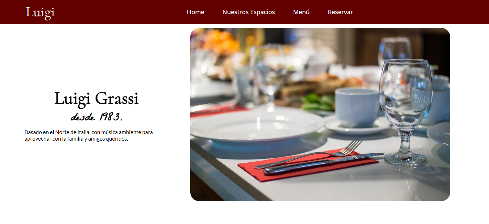

<h1>Luigi Grassi</h1>

This is a Landing Page for practice. In this project, I've used for the first time the software Figma for design.

 

<h2>Project preview</h2>

 

<h2>📚 Technologies:</h2>
<ul>
    <li>Figma</li>
    <li>HTML</li>
    <li>CSS</li>
    <li>JavaScript</li>
    <li>Git and Github</li>
</ul>

<h2>💻 Project:</h2>

This is a landing page that aims to gain new knowledge and fix information already learned. We can see that it is an Italian restaurant and the functionality of the site includes showing its main dishes, the menu and a form for a reservation.

Doind this project I learned how to display a PopUp window and retained much of my knowledge of landing pages.

 

Visit the Project Online: <a href="https://ggabi40.github.io/Luigi-Grassi">Click Here!</a>

Desenvolved with ♥️ by <a href="https://ggabi40.github.io/linktree">GGabi40</a>.
